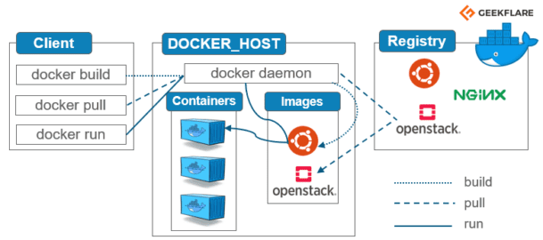

# Day 1 of 40 Days of Kubernetes: 🚀 Getting Started with Docker: Architecture & Workflow 🌐☸️

As part of my journey through the #40DaysOfKubernetes challenge, I’m excited to share some key insights into Docker's architecture and workflow. Docker is a cornerstone in the DevOps world, enabling developers to create, deploy, and manage containerized applications efficiently. Whether you're new to Docker or just looking for a refresher, this article will guide you through the essentials!
🔍 Understanding Docker Architecture

Docker’s architecture consists of several core components that work together to ensure smooth containerized application management. Here’s a quick breakdown:
1. Docker Client

    This is where you interact with Docker, using commands like docker run and docker pull. The client communicates with the Docker Daemon to manage containers.

2. Docker Daemon

    Running in the background, the daemon (dockerd) takes care of the heavy lifting by managing containers, images, and networks.

3. Docker Registry

    A repository for Docker images. The default is Docker Hub, but private registries are available for secure, internal usage. Here, you’ll find a vast library of public images that can be used or customized.

4. Docker Objects (Images, Containers, and Volumes)

    Images: A read-only template with instructions for creating a Docker container.
    Containers: A runnable instance of an image. They’re portable, consistent, and isolated.
    Volumes: Used for data persistence in containers, as containers themselves are stateless by nature.

5. Docker Networking

    Docker offers various networking options, such as bridge, host, and overlay networks, enabling communication between containers and external networks.

👉 Diagram:

🔄 A Sample Docker Workflow

Here’s a look at the typical steps involved in a Docker workflow:

    Build: Create a Dockerfile that defines your application setup. Run docker build -t yourimagename . to build the image.
    Push: Once the image is built, you can push it to a Docker registry like Docker Hub for easy distribution.
    Pull: On any host machine, pull the image with docker pull to deploy it in new environments.
    Run: Use docker run yourimagename to run a container based on the image. Manage containers with docker stop, docker start, and other commands.

👉 Diagram:

🎓 Key Takeaways from the Docker Video Lesson

While exploring Docker’s architecture and workflow through a video resource, I uncovered several valuable insights:

    Simplicity & Portability: Docker solves the classic "it works on my machine" problem, making it easy to deploy applications consistently across different environments.
    Efficient Resource Usage: Containers are lightweight and consume fewer resources than virtual machines, as they share the host OS kernel.
    A Thriving Ecosystem: Docker has an expansive library of pre-built images, and its strong community support makes it ideal for modern application development.

🌐 Sharing My Learning Journey

I’m excited to share this article as part of my #40DaysOfKubernetes journey! I encourage you to follow along and check out the hashtag for insights from others as well. Connect with me and let’s grow together in the world of Kubernetes and DevOps!

A special shoutout to Tagging[@PiyushSachdeva](https://www.linkedin.com/in/piyush-sachdeva) and [@CloudOps Community](https://www.linkedin.com/company/thecloudopscomm) for the inspiration to share my learning journey. 🎉

Interested in the details? Check out these helpful resources:

https://www.geeksforgeeks.org/architecture-of-docker/
https://geekflare.com/docker-architecture/ https://k21academy.com/docker-kubernetes/docker-architecture-docker-engine-components-container-lifecycle/   

Let’s continue learning and sharing in this fantastic community! #CloudOps #DevOps #Docker #Kubernetes