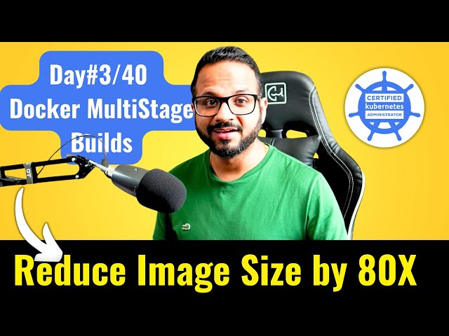

# Day 3 of 40 Days of Kubernetes: 🚀 Dockerizing a Project with Multistage Builds 🐳🚀 🚀 🌐☸️



For today's task in the #40DaysOfKubernetes challenge, I’ll show how to Dockerize an application using a multistage build to optimize the image size. Along the way, I’ll share best practices for writing Dockerfiles and explore the docker init command. Finally, I’ll push the image to Docker Hub and include my GitHub repository containing the Dockerfile.
## Step 1: Clone the Application

First, either clone an existing GitHub app or use your own project. Here, I’m using a Node.js sample project:
```
git clone https://github.com/docker/getting-started-app.git
cd getting-started-app/
```
## Step 2: Create a Dockerfile with Multistage Build

A multistage build helps reduce the size of your final image by separating the build process from the production environment.

### Create a Dockerfile using:

    touch Dockerfile

Here’s the Dockerfile content for multistage builds:

Dockerfile

# Stage 1: Build
```
FROM node:18-alpine AS build
WORKDIR /app
COPY package*.json ./
RUN yarn install
COPY . .
RUN yarn run build
```
# Stage 2: Production
```
FROM node:18-alpine
WORKDIR /app
COPY --from=build /app /app
RUN yarn install --production
CMD ["node", "src/index.js"]
EXPOSE 3000
```
Explanation:

    Stage 1 (build): Installs all dependencies and builds the app.
    Stage 2: Only copies necessary files from the build stage, installing production dependencies only, which reduces the image size.

## Step 3: Build the Docker Image

Run the following command to build the Docker image:
```
docker build -t day03-multistage-todo .
```
## Step 4: Push the Image to Docker Hub
Login and push the image:
```
docker login
docker tag day03-multistage-todo:latest yourusername/multistage-app:latest
docker push yourusername/multistage-app:latest
```
### Step 5: Pull and Run the Image

Pull the image to another environment and run the container:
```
docker pull yourusername/multistage-app:latest
docker run -dp 3000:3000 yourusername/multistage-app:latest
```
## Step 6: Explore docker init

Docker's docker init command can automatically generate a Dockerfile based on the app:
```
docker init
```
This command can simplify Dockerizing a project, but I used a custom Dockerfile for more control.
Benefits of Multistage Builds
1. Reduced Image Size: Only production dependencies are included.
2. Improved Security: Fewer dependencies reduce the attack surface.
3. Faster Deployments: Smaller images lead to quicker deployments and fewer resources used.

## Best Practices for Dockerfile:

Some key Dockerfile best practices:

1. Use specific base images to avoid unnecessary dependencies.
2. Minimize layers to improve build performance.
3. Leverage multistage builds to keep the final image clean and small.

### For more best practices, check out the official Docker documentation.
GitHub Repository with Dockerfile:
https://github.com/Neivanny1/40DaysOfKubernetes-/blob/main/Day03/Blog_Website/Dockerfile

### 🔗 My Multistage Docker App on GitHub:
https://github.com/Neivanny1/40DaysOfKubernetes-/blob/main/Day03/Blog_Website

## Sharing My Learnings

Today’s task highlighted the importance of Dockerfile best practices and how multistage builds can optimize your images. Big thanks to [@PiyushSachdeva](https://www.linkedin.com/in/piyush-sachdeva) and [@CloudOps Community](https://www.linkedin.com/company/thecloudopscomm) for the inspiration.

#Docker #MultistageBuild #DevOps #40DaysOfKubernetes #Kubernetes #CKA
