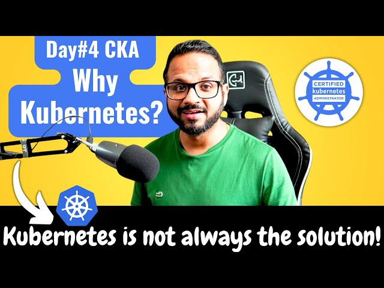

# Day 4 of 40 Days of Kubernetes: 🚀 Challenges of Standalone Containers and How Kubernetes Solves Them 🚀 🌐☸️

In today's task of the #40DaysOfKubernetes challenge, I explored the limitations of using standalone containers and how Kubernetes addresses those challenges. I also identified key use cases where Kubernetes is ideal and others where it may not be the best solution.

## Challenges of Using Standalone Containers

While containers are a great way to package and run applications, managing them at scale presents several challenges:

1. Scaling: Manually scaling individual containers across multiple machines can be difficult.
2. Load Balancing: Handling traffic distribution between multiple containers requires additional configuration.
3. Self-healing: If a container crashes, restarting it manually is tedious and time-consuming.
4. Service Discovery: In a large environment, keeping track of containers and services manually is complex.
5. Updates and Rollbacks: Upgrading containerized applications without downtime or the ability to roll back to a previous state can be risky.

## How Kubernetes Solves These Challenges

Kubernetes (K8s) is a powerful platform for managing containerized applications across clusters of machines. Here’s how it addresses the challenges of standalone containers:

1. Automatic Scaling: Kubernetes scales applications automatically based on traffic and resource usage using Horizontal Pod Autoscalers.
2. Built-in Load Balancing: K8s distributes network traffic efficiently across containers (Pods) with its built-in load balancers.
3. Self-healing: Kubernetes automatically restarts failed containers, ensuring high availability and resilience.
4. Service Discovery: Kubernetes provides internal DNS and networking services to simplify communication between containers.
5. Automated Rollouts & Rollbacks: Kubernetes makes updates seamless and allows easy rollbacks in case of issues, minimizing downtime.

## 5 Use Cases Where Kubernetes is Ideal

### 1. Microservices Architectures: Managing a large number of independent services that need coordination.
### 2. Continuous Deployment: Automating updates, rollbacks, and scaling in a CI/CD pipeline.
### 3. High Availability Applications: Ensuring your applications stay online even in case of failures.
### 4. Hybrid Cloud Environments: Running apps across multiple cloud providers or on-prem infrastructure.
### 5. Resource-Intensive Applications: Dynamic resource allocation for big data, AI/ML workloads, or any other heavy resource-consuming apps.

## 5 Use Cases Where Kubernetes May Not Be Necessary

### 1. Simple Applications: Small-scale projects with low traffic that don't require complex scaling.
### 2. Monolithic Architectures: If the application is a single unit, Kubernetes might be overkill.
### 3. Limited Resources: Kubernetes has a steep learning curve and overhead; for basic apps, it may add unnecessary complexity.
### 4. Tight Deadlines: For quick-and-dirty projects where setting up infrastructure isn't feasible in the short term.
### 5. Local Development: For local development environments where Docker Compose can suffice without requiring full orchestration.

## Key Takeaways
1. Standalone containers are great for isolating applications but lack the orchestration needed at scale.
2. Kubernetes excels in managing complex, large-scale containerized applications with features like scaling, self-healing, and service discovery.
3. While Kubernetes is powerful, it's not always necessary for smaller, simpler applications or local development.

## My Learnings 📚

Understanding the limitations of standalone containers and how Kubernetes provides powerful solutions for orchestrating them at scale has been a game-changer. I’ve seen firsthand how Kubernetes simplifies managing large, distributed systems.

Thank you to Tagging[@PiyushSachdeva](https://www.linkedin.com/in/piyush-sachdeva) and [@CloudOps Community](https://www.linkedin.com/company/thecloudopscomm) for the continued inspiration on this journey!

#Kubernetes #DevOps #ContainerOrchestration #40DaysOfKubernetes #CKA