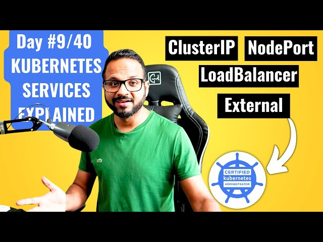

# Day 9/40 - Understanding Kubernetes Services: ClusterIP, NodePort, LoadBalancer & External ☸️

Today’s focus was on learning how Kubernetes Services work to enable internal and external application access in a Kubernetes cluster. Services in Kubernetes play a central role in connecting applications within a cluster and exposing them to external traffic when needed. Here's what I learned and implemented today, plus some helpful insights!

## 🛠 Task Overview
### Creating a ClusterIP Service for Internal Access:
I created a ClusterIP Service named myapp that exposed port 80 to make an Nginx pod accessible within the cluster only. ClusterIP is great for internal communication between services.

### Deploying the App:
I set up a deployment named myapp, running nginx:1.23.4-alpine as a container on port 80. After verifying functionality, I scaled the deployment to two replicas to simulate load balancing among multiple pods.
### Accessing the Service Internally with BusyBox:
Next, I launched a temporary BusyBox pod to test the ClusterIP Service using the wget command. The service worked seamlessly, confirming successful internal routing.

### Testing External Access with NodePort:
To expose myapp outside the cluster, I updated the service type to NodePort. This change assigned a specific port on each node to redirect traffic to the service, enabling external access.

### Using LoadBalancer for Cloud Environments:
While NodePort works well locally, LoadBalancer is often more efficient in managed cloud Kubernetes environments (like GKE, AKS, or EKS). Kubernetes configures an external load balancer that directs traffic to the cluster’s service without requiring a specific port number.

### Experimenting with ExternalName:
Finally, I explored ExternalName, which directs traffic to an external DNS name, bypassing the cluster's internal routing system. This method is especially helpful when connecting to services outside Kubernetes, like APIs.

## 🧩 Key Learnings

1. ClusterIP: Best for internal access only; exposes services within the cluster.
2. NodePort: Assigns a port on the host node, allowing external access to services. Suitable for development and testing environments.
3. LoadBalancer: Ideal for cloud-managed environments, providing automatic load balancing with easy DNS or IP access.
4. ExternalName: Directs traffic to an external service using a DNS name, making it valuable for API or external application integrations.

## Why These Service Types Matter

Understanding each type of Kubernetes service allows you to optimize application exposure within and outside the cluster. By utilizing NodePort, LoadBalancer, and ExternalName effectively, you ensure that the right kind of access is available depending on your application’s environment and requirements.

## 📺 Video Reference

For a deeper dive, watch the Day 9 video on Kubernetes Services: Kubernetes Services Explained - ClusterIP vs NodePort vs LoadBalancer

Feel free to share your experiences, ask questions, or connect with me to discuss Kubernetes and DevOps further!
## Tags:

[@Eric mwakazi](https://www.linkedin.com/in/eric-mwakazi), [@PiyushSachdeva](https://www.linkedin.com/in/piyush-sachdeva) and [@CloudOps Community](https://www.linkedin.com/company/thecloudopscomm)
#40daysofkubernetes #Kubernetes #DevOps #CloudComputing #Microservices #CloudNative #ClusterIP #NodePort #LoadBalancer #ExternalName