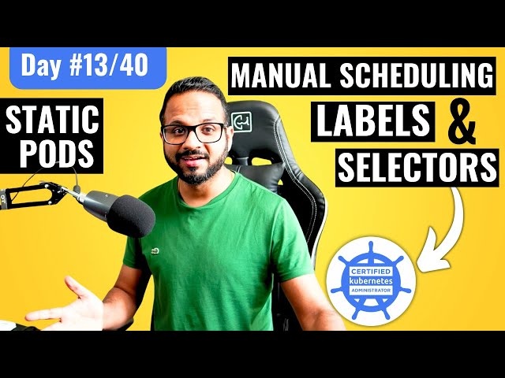

# Day 13/40 - Mastering Static Pods, Manual Scheduling, Labels, and Selectors in Kubernetes 📘🚀



As I continue with the #40daysofkubernetes challenge, today's deep dive included Static Pods, Manual Scheduling, Labels, and Selectors—key concepts for more granular control over Kubernetes environments. Here’s an overview of what I learned and how I implemented these tools.

## 🔍 Understanding Static Pods

Static Pods differ from regular pods in that they’re managed by the kubelet on each node rather than through the Kubernetes API server. They’re particularly useful for ensuring critical system-level services run on specific nodes without the involvement of the scheduler.

## Key Use Cases for Static Pods:

Essential control plane components like kube-apiserver, kube-scheduler, controller-manager, and etcd
Node-level monitoring or logging agents
Sample YAML for Static Pod

To create a Static Pod, I used the following YAML file, which is saved directly on the node in the default /etc/kubernetes/manifests/ directory. This way, the kubelet automatically manages and restarts it if needed.
```
#yaml
apiVersion: v1
kind: Pod
metadata:
  name: static-nginx
spec:
  containers:
  - name: nginx
    image: nginx
    ports:
    - containerPort: 80
```

## 🕒 Exploring Labels and Selectors in Kubernetes

Labels and selectors help organize resources based on custom key-value pairs, making it easier to manage and filter resources across namespaces.

### Examples of Labels and Selectors:

1. Labels: environment: dev, tier: frontend, app: web-server
2. Selectors: Filtering pods with kubectl get pods -l app=web-server allows for easy management of grouped resources.
## Labels vs. Namespaces
While namespaces isolate resources within a cluster, labels let me organize and select resources across namespaces, adding more flexibility to my setups.

## 🧭 Manual Pod Scheduling

Manual scheduling is useful when I need a pod to run on a specific node without the scheduler’s intervention. By setting the nodeName field in the pod spec, I can direct Kubernetes to place a pod on a given node.

### Example YAML for Manual Scheduling
```
#yaml
apiVersion: v1
kind: Pod
metadata:
  name: manual-nginx
spec:
  nodeName: worker-node-1
  containers:
  - name: nginx
    image: nginx
```
>>Tip: This method is helpful for targeted resource testing or running non-replicated services on specific nodes.

## 💡 Key Takeaways
Static Pods are ideal for system-level tasks, running directly on nodes.
Labels and Selectors streamline resource management across namespaces.
Manual Scheduling allows more control over node-specific workloads.
## 📺 Video Reference

To explore these concepts further, check out the Day 13 video on Static Pods, Manual Scheduling, Labels, and Selectors:

[](https://youtu.be/6eGf7_VSbrQ)

Practical Application of Today’s Learnings
The insights gained today are incredibly helpful for managing node-level workloads, organizing resources, and controlling specific deployments. Using these tools can ensure efficient resource management and fine-tune workload distribution across Kubernetes clusters.

[@Eric mwakazi](https://www.linkedin.com/in/eric-mwakazi), [@PiyushSachdeva](https://www.linkedin.com/in/piyush-sachdeva) and [@CloudOps Community](https://www.linkedin.com/company/thecloudopscomm)
#40daysofkubernetes #Kubernetes #DaemonSet #Job #CronJob #DevOps #ContainerOrchestration