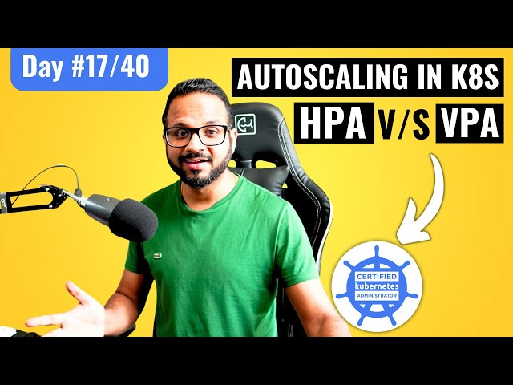

# Day 17/40 - Kubernetes Autoscaling: HPA vs. VPA 📈

Today’s focus was on Kubernetes Autoscaling, comparing the Horizontal Pod Autoscaler (HPA) with the Vertical Pod Autoscaler (VPA) to dynamically manage resources in a Kubernetes cluster. Autoscaling in Kubernetes is key to ensuring applications handle fluctuating demands without manual scaling. Here’s a rundown of the concepts and tasks covered.

## 🛠 Task Overview

1. Implementing HPA for Load Handling:

    Command Used: Scaled the php-apache deployment horizontally using HPA based on CPU usage, setting the scaling threshold to 50% CPU utilization.
    Setup: Created a deployment and generated a consistent load to test HPA functionality.

2. Deploying Sample Workloads with YAML Configurations:

    Created Deploy.yaml to configure the php-apache deployment and hpa.yaml to specify HPA settings.
    Defined limits and requests for CPU resources to ensure the autoscaler reacts to CPU load changes.

3. Monitoring HPA in Action:

    Verification: Used kubectl get hpa php-apache --watch to observe the scaling behavior as CPU utilization increased.
    Load Generation: Deployed a load generator to continuously apply pressure on the deployment, prompting HPA to add replicas as needed.

## 📘 Key Takeaways on HPA vs. VPA
### HPA (Horizontal Pod Autoscaler):
1. Purpose: Scales the number of pod replicas in response to CPU or memory utilization.
2. Best Use Cases: Ideal for stateless applications where scaling out is more beneficial than scaling up.

### VPA (Vertical Pod Autoscaler):
1. Purpose: Adjusts the CPU and memory of individual pods, scaling up the resources assigned to each pod without adding new replicas.
2. Best Use Cases: Useful for applications with variable resource requirements but stable traffic, like data processing or machine learning.

Together, HPA and VPA offer flexible scaling strategies to ensure applications stay performant while optimizing resource utilization.
Practical Application

>>HPA is best for applications needing to scale horizontally, especially when handling bursty traffic.

>>VPA is better suited for vertically scaling resource-heavy applications within a single pod instance.

In a real-world scenario, both HPA and VPA can work in tandem for advanced scalability and efficient resource allocation.

## 📺 Video Reference Check out the Day 17 video for a practical demonstration of HPA vs. VPA in Kubernetes.

## 🌐 Join the Discussion

What are your thoughts on using HPA and VPA in your Kubernetes setup? Share your experiences, and don’t forget to tag 
[@Eric mwakazi](https://www.linkedin.com/in/eric-mwakazi), [@PiyushSachdeva](https://www.linkedin.com/in/piyush-sachdeva) and [@CloudOps Community](https://www.linkedin.com/company/thecloudopscomm)

#40daysofkubernetes #Kubernetes #Autoscaling #DevOps #CloudComputing #Microservices