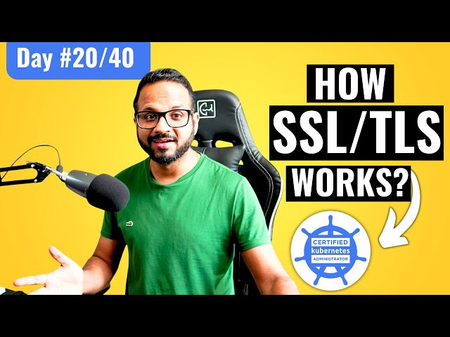

# Day 20/40 - Understanding SSL/TLS for Secure Connections 🔒

Today, I delved into the essentials of SSL/TLS (Secure Socket Layer / Transport Layer Security), the protocols that enable secure communication over the internet by encrypting data. They’re critical to ensure the confidentiality, integrity, and authenticity of online transactions and data transfers. Below, I break down how SSL/TLS works and how it’s essential for securing Kubernetes clusters as well.

## 🛠 Task Overview
### What is SSL/TLS?
SSL/TLS Basics: These protocols establish a secure connection between two systems, like a web server and a client, by encrypting data exchanged over the network. TLS is the successor to SSL and provides stronger encryption standards.

### Purpose:
SSL/TLS prevents eavesdropping, tampering, and message forgery, ensuring data privacy and security.

## How SSL/TLS Works
### Handshake Process:
1. The client initiates the connection by requesting an encrypted session.
2. The server responds with its SSL certificate containing a public key.
3. The client verifies the server’s certificate authenticity.
4. Once verified, the client generates a session key, encrypts it using the server’s public key, and sends it to the server.
5. Both server and client use the session key to encrypt and decrypt data for the duration of the session.

## Key Concepts:
1. Encryption: Ensures data remains confidential.
2. Public Key Infrastructure (PKI): Manages digital certificates and encryption keys.
3. Certificates: Digital documents issued by trusted Certificate Authorities (CAs) that authenticate servers.

## Simplified Diagram of SSL/TLS Handshake

Imagine a simple three-part handshake between two entities, one representing the client and the other representing the server.

Step 1: Client initiates a secure connection.

Step 2: Server responds with its SSL certificate, including the public key.

Step 3: The client validates the certificate, generates a session key, encrypts it, and sends it to the server.

Step 4: Both parties use the session key to securely encrypt and decrypt data.

## 📘 Key Takeaways on SSL/TLS
1. Security Layer: SSL/TLS is essential in Kubernetes clusters for securing API servers and communications between microservices.
2. Trust and Authentication: Digital certificates build trust, ensuring that users communicate with legitimate servers.
3. Encryption and Integrity: Encryption protects data from exposure, and data integrity prevents unauthorized modifications.

## 📺 Video Reference For a visual guide, check out the Day 20 video on SSL/TLS.

## Sharing

Secure your applications and data with SSL/TLS! Share your experiences with #40daysofkubernetes, and tag [@Eric mwakazi](https://www.linkedin.com/in/eric-mwakazi), [@PiyushSachdeva](https://www.linkedin.com/in/piyush-sachdeva) and [@CloudOps Community](https://www.linkedin.com/company/thecloudopscomm) to join the discussion.

#Kubernetes #40DaysOfKubernetes #SSL #TLS #DevOps #CloudSecurity #Encryption