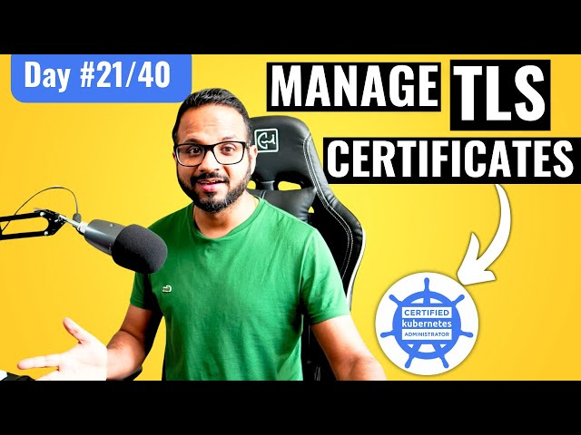

# Day 21/40 - Managing TLS Certificates in Kubernetes 🛠️



Today’s focus was on understanding how to generate and manage TLS certificates in Kubernetes using PKI (Public Key Infrastructure). This task is crucial for securing communications within the Kubernetes cluster. Here’s a step-by-step overview of the tasks and commands used.

## 🛠 Task Breakdown
1. Generate a Private Key and CSR (Certificate Signing Request)
2. Created a PKI private key and CSR named learner.key and learner.csr, respectively.

Command:
```
openssl genrsa -out learner.key 2048

openssl req -new -key learner.key -out learner csr -subj "/CN=learner"
```
3. Create and Encode the CertificateSigningRequest (CSR): Used the encoded value of learner.csr in the CSR request.

4. Created a Kubernetes CertificateSigningRequest with the necessary expiration date of one week.

5. Approve the CSR and Retrieve the Certificate :Approved the CSR to ensure it was signed and issued by the Kubernetes API.

Command:
```
kubectl certificate approve <csr-name>
```
6. Export and Decode the Certificate: 
Exported the certificate from the CSR and saved it to a YAML file.
7. Redirected the decoded certificate value to learner.crt file.
Command to decode the certificate:
```
kubectl get csr <csr-name> -o jsonpath='{.status.certificate}' | base64 --decode > learner.crt
```
8. Verification and Next Steps
        Verified each step of the certificate creation and approval process.
        This setup forms the basis for further secure communications, with additional steps to come in Day 22.

## 📘 Key Takeaways on TLS in Kubernetes

    PKI (Public Key Infrastructure): The foundation of secure communications, essential for managing TLS certificates.
    Certificate Approval Process: Required for Kubernetes components to ensure that communication within the cluster is secure.
    Control Plane Components: TLS certificates play a key role in the security of control plane components, ensuring secure data exchange across the cluster.

## 💡 Commands and Resources

    Generate Key: openssl genrsa -out <filename>.key 2048
    Generate CSR: openssl req -new -key <filename>.key -out <filename>.csr -subj "/CN=<common-name>"
    Approve CSR: kubectl certificate approve <csr-name>
    Deny CSR: kubectl certificate deny <csr-name>
    Kubernetes Documentation on CSR

## Video Reference

For a detailed walkthrough, watch the Day 21 video on TLS in Kubernetes:

[](https://youtu.be/LvPA-z8Xg4s)

## Connect and Share 🚀

If you’re also exploring Kubernetes or have insights on managing certificates, I’d love to hear from you! Tagging [@Eric mwakazi](https://www.linkedin.com/in/eric-mwakazi), [@PiyushSachdeva](https://www.linkedin.com/in/piyush-sachdeva) and [@CloudOps Community](https://www.linkedin.com/company/thecloudopscomm) to join the discussion.

#40daysofkubernetes #Kubernetes #TLS #Security #CloudComputing #DevOps