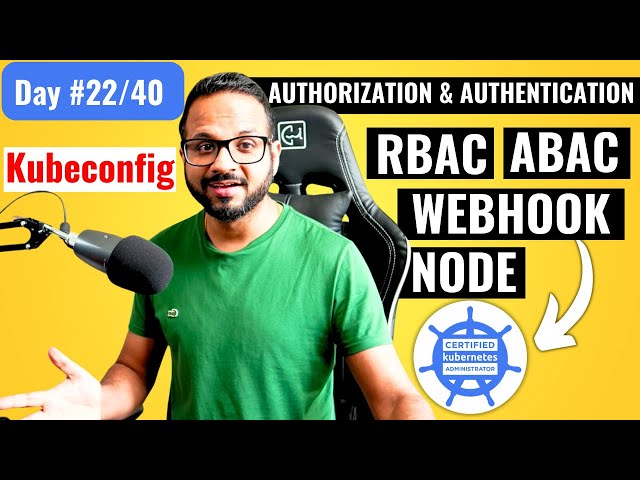

# Day 22/40 - Kubernetes Authentication and Authorization 🌐🔐



Today’s topic covered one of the essential security layers in Kubernetes—Authentication and Authorization. These two components form the backbone of secure access within any Kubernetes cluster, allowing only verified identities and authorized actions.

## 📍 Key Concepts
### Authentication: Verifying Identity

1. Kubeconfig as a Keycard: The kubeconfig file acts as your unique identification to access the Kubernetes API server, storing certificates and keys for authentication.

2. API Calls with kubectl:
By default, Kubernetes uses $HOME/.kube/config for accessing clusters, so there’s no need to specify --kubeconfig in every command.

Sample commands:
```
kubectl get pods --kubeconfig config
kubectl get pods
```
3. Raw API Calls: For specific use cases, raw API calls help authenticate securely with keys and certificates.
```
kubectl get --raw /api/v1/namespaces/default/pods \
        --server https://localhost:64418 \
        --client-key adam.key \
        --client-certificate adam.crt \
        --certificate-authority ca.crt
```

## Authorization: Defining Access

1. Node Authorizer: Ensures only authorized kubelets on nodes communicate with the API server.
2. RBAC (Role-Based Access Control): The most recommended way to manage access, RBAC allows roles and permissions to be easily set up and assigned to users, making it user-friendly and scalable.
3. ABAC (Attribute-Based Access Control): Although flexible, it can be challenging to manage in large environments.

4. Webhooks: Optional external tools like OPA can be used for complex authorization checks.

### Authorization Modes:

>Kubernetes prioritizes authorization modes in the following order:

        Node Authorizer
        RBAC
        Webhook (if enabled)

### 🛠 Commands Used

1. List Pods:
```
kubectl get pods
```
2. Raw API Call:
```
kubectl get --raw /api/v1/namespaces/default/pods \
      --server https://localhost:64418 \
      --client-key adam.key \
      --client-certificate adam.crt \
      --certificate-authority ca.crt
```

## 🔑 Key Takeaways

1. Authentication: Verifies who you are. Managed through certificates and kubeconfig.
2. Authorization: Determines what you can do. RBAC is recommended for most production environments.
3. Security Layers: Ensuring proper roles and permissions with RBAC simplifies access control and enhances security.
4. Kubernetes’ secure design reinforces that only verified users can access resources based on their assigned roles.

## 📽️ Video Reference

For a visual guide, check out the Day 22 video on Authentication and Authorization in Kubernetes:

[](https://youtu.be/P0bogYEyfeI)

## 🔗 Share Your Insights

Sharing our knowledge not only helps the community but strengthens our understanding. If you’re also diving into Kubernetes or have valuable tips, share your journey! Tagging [@Eric mwakazi](https://www.linkedin.com/in/eric-mwakazi), [@PiyushSachdeva](https://www.linkedin.com/in/piyush-sachdeva) and [@CloudOps Community](https://www.linkedin.com/company/thecloudopscomm) to join the discussion.

#40daysofkubernetes #Kubernetes #Authentication #Authorization #RBAC #DevOps