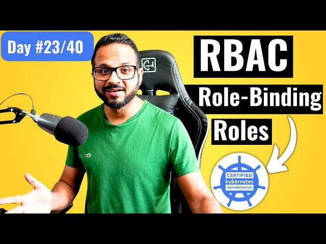

# Day 23/40 - Kubernetes Role-Based Access Control (RBAC) 👤🔑



Today’s task dives deeper into Role-Based Access Control (RBAC) in Kubernetes, a critical feature for managing user permissions. We created and tested roles, granting limited access to users while ensuring secure resource control within our cluster.

## 🔍 Key Concepts
### Role and RoleBinding
1. Role: Defines a set of permissions within a specific namespace. A Role can allow actions like get, list, and watch on resources like Pods.
2. RoleBinding: Links a Role to specific users, granting them the permissions specified in that Role.

### 🛠️ Step-by-Step Commands

1. Generate the Key and CSR for a user, here named "krishna" (or any other name you choose).
```
openssl genrsa -out krishna.key 2048
openssl req -new -key krishna.key -out krishna.csr -subj "/CN=krishna"
```
2. Switch to krishna's Context:
```
kubectl config set-context krishna --cluster=<cluster-name> --user=krishna
kubectl config use-context krishna
```
3. Check Permissions: To see krishna’s permissions.
```
kubectl auth can-i create pods
```
4. Expected Result: krishna cannot create Pods yet, as no permissions are assigned.

5. Granting Access to the User
Switch to Admin Context:
```
kubectl config use-context admin
```
6. Create a Role named pod-reader in the default namespace:
```
apiVersion: rbac.authorization.k8s.io/v1
kind: Role
metadata:
  namespace: default
  name: pod-reader
rules:
- apiGroups: [""]
  resources: ["pods"]
  verbs: ["get", "watch", "list"]
```
```
kubectl apply -f pod-reader-role.yaml
```
7. Create a RoleBinding named read-pods to assign the pod-reader role to krishna.
```
apiVersion: rbac.authorization.k8s.io/v1
kind: RoleBinding
metadata:
  name: read-pods
  namespace: default
subjects:
- kind: User
  name: krishna
  apiGroup: rbac.authorization.k8s.io
roleRef:
  kind: Role
  name: pod-reader
  apiGroup: rbac.authorization.k8s.io
```
```
kubectl apply -f rolebinding.yaml
```
8. Verify Permissions for krishna:
```
kubectl auth can-i get pods --as krishna
```
## 📝 Test Results and Observations

### Creating a New Pod:
1. Expected: krishna does not have permission to create a new Pod and should receive an error.
### Listing Pods:
1. Expected: krishna can successfully list Pods, as allowed by the pod-reader role.
### Creating a Deployment:
1. Expected: krishna does not have permission to create deployments, so an error should occur.

## 🔑 Key Takeaways

1. RBAC Controls User Access: Fine-grained control over user actions ensures better security and efficient role delegation.
2. Role and RoleBinding: Together, they define who can access which resources and perform what actions.
3. Test Permissions: Using commands like kubectl auth can-i helps verify user access for specific operations, which is useful for troubleshooting and setup verification.

## 📽️ Video Reference

For a visual guide, check out the Day 23 video on Kubernetes RBAC:
[](https://youtu.be/uGcDt7iNFkE)

## 🔗 Share Your Insights

Learning RBAC helps us build robust, secure Kubernetes environments. If you’re working on similar tasks or want to share insights, let’s connect! Tagging [@Eric mwakazi](https://www.linkedin.com/in/eric-mwakazi), [@PiyushSachdeva](https://www.linkedin.com/in/piyush-sachdeva) and [@CloudOps Community](https://www.linkedin.com/company/thecloudopscomm) to join the discussion.

#40daysofkubernetes #RBAC #Kubernetes #AccessControl #DevOps