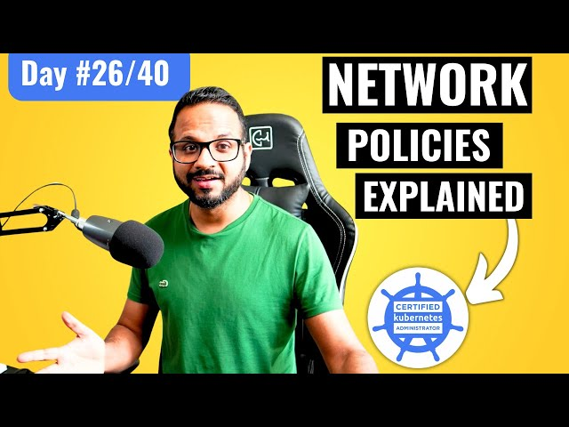

# Day 26/40 - Kubernetes Network Policies for Fine-Grained Access Control 🚦🔒



Today’s session delved into Network Policies in Kubernetes, which allow us to control traffic flow between pods and services. This feature is especially valuable in production environments, where security and data isolation are critical.

## 📚 What are Network Policies?

Network policies in Kubernetes serve as firewalls for pods, governing ingress (incoming) and egress (outgoing) traffic. By defining a network policy, we can restrict which pods or services can access each other. A common scenario would involve restricting access to a database so that only specific services can interact with it.

## 🛠️ Practical Steps in Network Policies
### 1. Disable the Default CNI and Create a Kind Cluster:

Start with a custom configuration:
```
kind: Cluster
apiVersion: kind.x-k8s.io/v1alpha4
nodes:
- role: control-plane
  extraPortMappings:
  - containerPort: 30001
    hostPort: 30001
- role: worker
- role: worker
networking:
  disableDefaultCNI: true
  podSubnet: 192.168.0.0/16
```
### 2. Install Calico as a Network Add-on:

Calico enables advanced network policy configurations.
Using the official documentation to install Calico on your Kind cluster:
[Calico Installation](https://docs.tigera.io/calico/latest/getting-started/kubernetes/kind)

### 3. Create the Deployments:
1. frontend and backend deployments with nginx images, and db deployment with mysql. Each deployment has 1 replica.

2. Expose each deployment as a NodePort service:
```
apiVersion: apps/v1
kind: Deployment
metadata:
  name: frontend
spec:
  replicas: 1
  selector:
    matchLabels:
      app: frontend
  template:
    metadata:
      labels:
        app: frontend
    spec:
      containers:
      - name: nginx
        image: nginx
        ports:
        - containerPort: 80
---
apiVersion: v1
kind: Service
metadata:
  name: frontend
spec:
  type: NodePort
  selector:
    app: frontend
  ports:
  - port: 80
    targetPort: 80
```
### Test Connectivity:
Ensure all pods can communicate without restrictions initially. Use kubectl exec to verify communication between frontend, backend, and db pods.
### Define and Apply a Network Policy:

Restrict access to the db so only backend can access it on port 3306:
```
apiVersion: networking.k8s.io/v1
kind: NetworkPolicy
metadata:
  name: db-access
spec:
  podSelector:
    matchLabels:
      app: db
  policyTypes:
  - Ingress
  ingress:
  - from:
    - podSelector:
        matchLabels:
          app: backend
    ports:
    - protocol: TCP
      port: 3306
```

## 🔍 Observations & Learnings
1. Fine-Grained Traffic Control: Network policies enable precise control over pod interactions, enhancing security.
2. Calico and Network Policies: Using Calico allows for more flexible and robust network policy configurations.
3. Real-World Application: This setup is typical in environments where access to sensitive services (like a database) must be restricted to trusted services.

## 📝 Key Takeaways

1. Network Policies are essential for Kubernetes security and traffic management.
2. Calico is a powerful network add-on that complements Kubernetes’ default networking features.

## 📽️ Video Reference

For a more in-depth guide on network policies, check out the embedded video here:
[](https://youtu.be/eVtnevr3Rao)
## 🔗 Share Your Insights

A great learning experience on network segmentation in Kubernetes! Tagging [@Eric mwakazi](https://www.linkedin.com/in/eric-mwakazi), [@PiyushSachdeva](https://www.linkedin.com/in/piyush-sachdeva) and [@CloudOps Community](https://www.linkedin.com/company/thecloudopscomm) to join the discussion.

#40daysofkubernetes #NetworkPolicies #Kubernetes