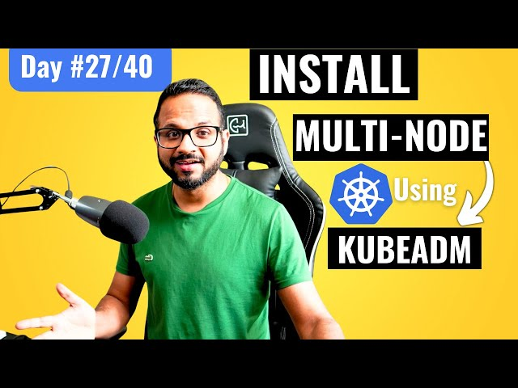

# Day 27/40: Setting up a Multi-Node Kubernetes Cluster with Kubeadm



Welcome to Day 27! Today, we’re focusing on setting up a multi-node Kubernetes cluster using kubeadm. This article will break down each step in the setup, covering both configuration details and networking essentials. By the end, we’ll have a master and two worker nodes connected and ready to deploy workloads. Let’s dive in!

## What is kubeadm?

Kubeadm is a Kubernetes tool that bootstraps clusters, simplifying the installation of essential components. Along with installing control plane components—like ApiServer, ETCD, Controller Manager, and Scheduler—kubeadm also helps set up CLI tools like kubeadm, kubelet, and kubectl.
## Main Ways to Install Kubernetes

There are several ways to install Kubernetes, but in this demo, we’ll be focusing on Self-Managed installations on virtual machines.

>Tip: Mac Silicon users might find Multipass helpful, as VirtualBox has compatibility issues. Alternatively, you can spin up virtual machines on a cloud provider like AWS.

## Step-by-Step: Setting Up the Kubernetes Cluster

### Requirements:

1. VMs (1 Master, 2 Workers)
2. Security Groups: If using AWS EC2, configure 3. 2 security groups for your nodes and set specific port allowances [Kubernetes Network Ports](https://kubernetes.io/docs/reference/networking/ports-and-protocols/).


### Step 1: SSH into Master Node

First, SSH into your master node, then:

#### 1. Disable Swap:
```
swapoff -a
sudo sed -i '/ swap / s/^\(.*\)$/#\1/g' /etc/fstab
```
#### 2. Set up Kernel Modules for Bridged Traffic:

cat <<EOF | sudo tee /etc/modules-load.d/k8s.conf
overlay
br_netfilter
EOF

sudo modprobe overlay
sudo modprobe br_netfilter

#### 3. Configure System Parameters:

cat <<EOF | sudo tee /etc/sysctl.d/k8s.conf
net.bridge.bridge-nf-call-iptables  = 1
net.bridge.bridge-nf-call-ip6tables = 1
net.ipv4.ip_forward                 = 1
EOF

sudo sysctl --system

#### 4. Install Container Runtime (containerd):
```
curl -LO https://github.com/containerd/containerd/releases/download/v1.7.14/containerd-1.7.14-linux-amd64.tar.gz

sudo tar Cxzvf /usr/local containerd-1.7.14-linux-amd64.tar.gz
```
#### 5. Install Kubeadm, Kubelet, and Kubectl:
```
sudo apt-get update
sudo apt-get install -y apt-transport-https ca-certificates curl gpg
curl -fsSL https://pkgs.k8s.io/core:/stable:/v1.29/deb/Release.key | sudo gpg --dearmor -o /etc/apt/keyrings/kubernetes-apt-keyring.gpg
```
### Step 2: Initializing the Master Node

After setting up container runtime and CLI tools, we initialize the control plane with kubeadm init.
```
sudo kubeadm init --pod-network-cidr=192.168.0.0/16 --apiserver-advertise-address=<your-master-IP> --node-name master
```
Copy the join command generated at the end, which you’ll use on the worker nodes.

#### Configure kubectl for Master
```
mkdir -p $HOME/.kube
sudo cp -i /etc/kubernetes/admin.conf $HOME/.kube/config
sudo chown $(id -u):$(id -g) $HOME/.kube/config
```
#### Install Calico Networking
```
kubectl create -f https://raw.githubusercontent.com/projectcalico/calico/v3.28.0/manifests/tigera-operator.yaml
curl https://raw.githubusercontent.com/projectcalico/calico/v3.28.0/manifests/custom-resources.yaml -O
kubectl apply -f custom-resources.yaml
```
### Step 3: Configuring Worker Nodes

1. Repeat Setup on Worker Nodes: Perform Steps 1–8 from the Master setup on each worker node.

2. Join Worker Nodes to Cluster: Use the kubeadm join command generated on the master node.
```
sudo kubeadm join <master-IP>:6443 --token <your-token> --discovery-token-ca-cert-hash sha256:<hash>
```
### Validation

After connecting the worker nodes, verify all nodes are active with:
```
kubectl get nodes
kubectl get pods -A
```
>>Tip: If calico-node pods aren’t healthy, ensure source/destination checks are disabled and update security groups as per Kubernetes recommendations.

## Key Takeaways

1. Networking Challenges: Configuring bridged traffic and managing security group rules on cloud platforms can be complex but are crucial for stability.
2. Kubeadm as a Bootstrap Tool: Kubeadm simplifies cluster setup but requires familiarity with additional configuration for a production-ready environment.
3. Calico CNI Plugin: Calico’s network policies and flexibility are essential for Kubernetes networking, especially on cloud infrastructure.

## 📽️ Video Reference
[](https://youtu.be/WcdMC3Lj4tU)

## Sharing the Journey

As part of this challenge, I’ll be sharing key insights on social media! Check out my post on LinkedIn or Twitter, where I tag [@Eric mwakazi](https://www.linkedin.com/in/eric-mwakazi), [@PiyushSachdeva](https://www.linkedin.com/in/piyush-sachdeva) and [@CloudOps Community](https://www.linkedin.com/company/thecloudopscomm) to join the discussion.

#40daysofkubernetes #Kubernetes