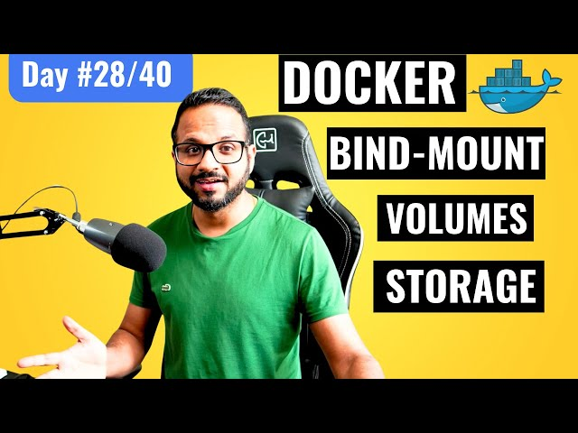

# Day 28 of 40: Docker Volumes, Bind Mounts, and Persistent Storage Explained



Today’s Goal: Dive into Docker’s storage mechanisms, including volumes and bind mounts, and understand how Docker manages persistent data storage. We’ll discuss Docker’s layered architecture, experiment with different storage options, and cover best practices.

## Overview: Docker Storage Essentials

Docker’s storage model is a fundamental aspect of container management. Containers are ephemeral by default, meaning data is lost when the container stops. However, for real-world applications, persistent storage is critical. Docker provides two main methods for persisting data outside of containers: Volumes and Bind Mounts.
## Key Concepts in Docker Storage

1. Volumes: Managed by Docker and stored in a Docker directory on the host (/var/lib/docker/volumes). Volumes are great for data sharing across multiple containers, backups, and system management, and they offer more control and flexibility than other methods.

2. Bind Mounts: Allows mounting any path on the host into a container, using the host filesystem directly. Although flexible, bind mounts require attention to security and permissions.

## Setting Up Persistent Storage with Docker Volumes
### 1. Create a Volume

##### Run a Container with a Volume:
```
docker volume create my_volume
docker run -d --name my_container -v my_volume:/data alpine
```
##### 2. Verify the Volume:
```
docker volume ls
```
##### 3.Inspect the Volume:
```
docker volume inspect my_volume
```

### 2. Experiment with Bind Mounts

##### 1. Set Up a Bind Mount:

```
docker run -d --name bind_mount_container -v $(pwd)/data:/app/data alpine
````

##### 2. Explore Permissions:
Using bind mounts requires file system permissions on the host, which might differ depending on the host OS and Docker configuration.

## Understanding Docker’s Layered Architecture

Docker images are made up of multiple layers, each representing a set of file system changes. Using Docker volumes and bind mounts helps maintain a clean layering model, avoiding unnecessary duplication and making data management more efficient.

1. Efficiency: Layered architecture allows Docker to share image layers across containers, reducing storage overhead.
2. Isolation: Each container operates independently, but volumes provide a bridge for data sharing without compromising isolation.

## Port Binding and Cluster-Level Considerations

If you're using a local Kubernetes cluster setup with KIND, you can apply port bindings at the cluster level. Check out Day 9’s video for detailed instructions on configuring port binding in KIND clusters.

## Key Takeaways

1. Volumes vs. Bind Mounts: Volumes are preferable for Docker-managed, persistent data, while bind mounts offer flexibility but require careful configuration.
2. Docker Layered Architecture: Leveraging Docker’s layered storage model optimizes data reuse across containers, enhancing both storage efficiency and application isolation.
3. Kubernetes Integration: Docker volumes simplify storage management in Kubernetes deployments, as they can be mounted and accessed across pods in a consistent way.

## 📽️ Video Reference
Check out the video on Docker Volumes below for additional context.
[](https://youtu.be/ZAPX21TMkkQ)

## Sharing Progress

I’ve documented today’s learning in this blog post on LinkedIn. Tagging As part of this challenge, I’ll be sharing key insights on social media! Check out my post where I tag [@Eric mwakazi](https://www.linkedin.com/in/eric-mwakazi), [@PiyushSachdeva](https://www.linkedin.com/in/piyush-sachdeva) and [@CloudOps Community](https://www.linkedin.com/company/thecloudopscomm) to join the discussion with the hashtag #40daysofkubernetes.