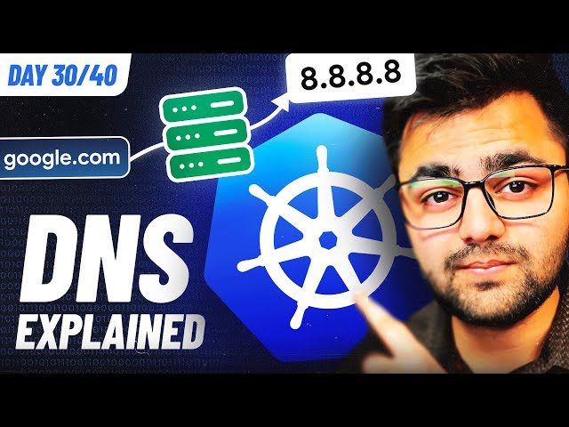

# Day 30/40 - Understanding DNS (Domain Name System): How the Internet Connects 🌐🔗

Today’s task takes us into the fascinating world of DNS (Domain Name System), often referred to as the internet’s phonebook. It’s the system that allows us to access websites using domain names like example.com instead of typing long and complex IP addresses. Let’s dive deeper into how DNS works and its key components!

## What is DNS?
The DNS system translates human-friendly domain names into machine-friendly IP addresses. This process ensures that when you type a URL into your browser, it knows exactly where to go on the internet.

Here’s an overview of the DNS resolution process:

#### 1. User Query:
The browser sends a DNS query for a domain name.

#### 2. Recursive Resolver:
This resolver searches for the IP address by communicating with other servers in the DNS hierarchy.

#### 3. Root Server:
It directs the resolver to the appropriate TLD (Top-Level Domain) server.

#### 4. TLD Server:
Responsible for the domain’s extension, like .com, .org, or .net, it points to the authoritative DNS server.

#### 5. Authoritative DNS Server:
This server holds the IP address for the requested domain and returns it to the resolver.

#### 6. Response:
The IP address is sent back to the browser, enabling the website to load.

## DNS Components and Terminology

### DNS Records:
These include mappings such as:
1. A Record: Maps a domain to an IPv4 address.
2. AAAA Record: Maps a domain to an IPv6 address.
3. CNAME Record: Alias for another domain name.

### DNS Cache:
Stores previous DNS lookups to reduce query time for frequently accessed domains.

### DNSSEC (DNS Security Extensions):
Enhances DNS by adding security to prevent attacks like DNS spoofing.

## Visual Representation
This diagram demonstrates the step-by-step journey of a DNS query.

## Key Insights from Day 30

1. DNS simplifies internet navigation, ensuring user-friendly access.
2. Its hierarchical structure optimizes query resolution.
3. DNS caching enhances speed and reduces redundancy.
4. DNSSEC adds a layer of security to prevent potential attacks.

## Reflection

Understanding DNS has deepened my appreciation for the seamless web experiences we often take for granted. It’s impressive how this system underpins internet connectivity.

## 📽️ Video Reference

Check out the video embedded below for a comprehensive explanation of DNS and how it works.

## Join the Conversation
Have you explored DNS before? What’s your biggest takeaway from today’s lesson? Share your thoughts, tagging [@Eric mwakazi](https://www.linkedin.com/in/eric-mwakazi), [@PiyushSachdeva](https://www.linkedin.com/in/piyush-sachdeva) and [@CloudOps Community](https://www.linkedin.com/company/thecloudopscomm), and using the hashtag #40daysofkubernetes.

Let’s keep learning together! 🚀