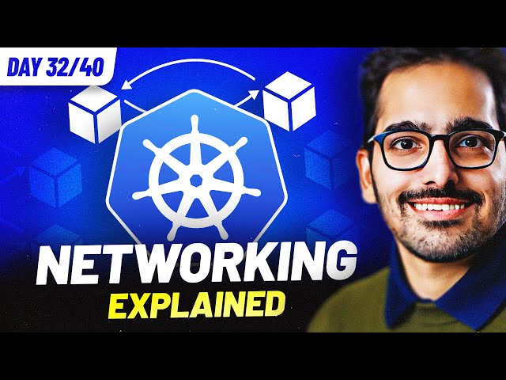

# Day 32/40 - Kubernetes Networking Explained | Container Network Interface (CNI) 🌐🧩



Today’s focus was on Kubernetes Networking and the Container Network Interface (CNI), an integral part of Kubernetes for enabling seamless communication between containers, pods, and external networks.

## 🤔 What is CNI?

CNI (Container Network Interface) is a specification and a set of libraries for configuring network interfaces in Linux containers. In Kubernetes, CNIs ensure that each pod gets a unique IP address and can communicate with other pods, services, and external networks.

## 📋 Key Steps for Exploring Kubernetes Networking

### 1. Set Up a Kubernetes Cluster:
If you don’t already have a cluster, create one locally. For example, with Kind:
```
kind create cluster --name kube-networking
```
### 2. Inspect the CNI Plugin:
Most Kubernetes setups use a CNI plugin like Calico, Flannel, or Weave. Verify the CNI installed in your cluster by checking the nodes:
```
kubectl get nodes
kubectl describe nodes | grep CNI
````

### 3. Install a CNI Plugin (Optional):
To install Calico as the CNI plugin:

```
kubectl apply -f https://docs.projectcalico.org/manifests/calico.yaml
```

### 4. Test Pod-to-Pod Communication:
Deploy two simple pods and test connectivity between them using their IPs.
Example:
```
kubectl run pod-a --image=busybox --restart=Never --command -- sleep 3600  
kubectl run pod-b --image=busybox --restart=Never --command -- sleep 3600  
kubectl exec pod-a -- ping <pod-b-IP>
```
### 5. Explore Service Networking:
Deploy a simple service and expose it. Test the service's communication using DNS or ClusterIP.

### 6. Customizing Network Policies:
Test isolation by creating network policies to restrict or allow traffic between pods. Example:

```
apiVersion: networking.k8s.io/v1
kind: NetworkPolicy
metadata:
  name: allow-specific-pod
spec:
  podSelector:
    matchLabels:
      app: pod-a
  ingress:
    - from:
        - podSelector:
            matchLabels:
              app: pod-b
```


## 🔍 Key Observations

1. Pod-to-Pod Communication: Kubernetes networking allows pods to communicate seamlessly across nodes without manual IP assignment.
2. CNI Plugins Simplify Networking: Plugins like Calico, Flannel, or Weave abstract the complexities of managing pod IPs and routes.
3. Network Policies: Allow granular control over which pods can communicate with each other, enhancing security.

## 📝 Key Takeaways

1. CNI is Fundamental: Kubernetes relies on CNI for dynamic and consistent networking across containers and nodes.
2. Flexibility with Plugins: You can use various CNI plugins to suit specific networking requirements in your environment.
3. Secure Networking: Network policies provide control over traffic flow within the cluster, enabling secure multi-tenant environments.

## 📽️ Video Reference

For a detailed guide, watch the video:

[](https://youtu.be/EkAzMGldC5M)

### 🔗 Additional Resources:
[GitHub Repository for Kubernetes Networking](https://github.com/saiyam1814/kube-networking)

## 🔗 Share Your Insights

Networking in Kubernetes is both fascinating and complex. Understanding CNI and network policies opens doors to managing secure, scalable clusters.

Have insights to share? What’s your go-to CNI plugin? Tagging [@Eric mwakazi](https://www.linkedin.com/in/eric-mwakazi), [@PiyushSachdeva](https://www.linkedin.com/in/piyush-sachdeva) and [@CloudOps Community](https://www.linkedin.com/company/thecloudopscomm) to dive deeper into the discussion!

#40daysofkubernetes #KubernetesNetworking #CNI #DevOps