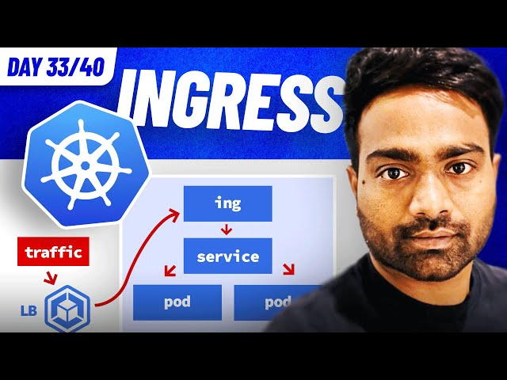

# Day 33/40 - Learning Ingress in Kubernetes 🌐📥



Today’s focus was on Ingress in Kubernetes, which provides a way to expose services externally using simple rules and host-based routing.

## 🤔 What is Ingress?

Ingress is an API object in Kubernetes that manages external access to services within a cluster. It offers HTTP(S) routing to services based on hostnames or paths. To use Ingress, an Ingress Controller must be running in the cluster.

## 📋 Step-by-Step Guide to Deploying with Ingress

### 1. Build and Push the Docker Image:
1. Build the application image:

```
docker build -t hello-world .
```

2. Tag and push the image to Docker Hub:

```
docker tag hello-world <dockerhub-username>/hello-world  
docker push <dockerhub-username>/hello-world  
```

### 2. Create a Deployment:
1. Create a deployment manifest (k8s/deployment.yaml):

```
apiVersion: apps/v1
kind: Deployment
metadata:
  name: web
spec:
  replicas: 1
  selector:
    matchLabels:
      app: web
  template:
    metadata:
      labels:
        app: web
    spec:
      containers:
      - name: nodejs-hello-world
        image: <dockerhub-username>/nodejs-hello-world:1.0.0
        ports:
        - containerPort: 3000
```

2. Apply the deployment:

```
kubectl apply -f k8s/deployment.yaml  
```

### 3. Expose the Deployment with a Service:

1. Create a service manifest (k8s/service.yaml):

```
apiVersion: v1
kind: Service
metadata:
  name: web
spec:
  selector:
    app: web
  ports:
  - protocol: TCP
    port: 80
    targetPort: 3000
  type: ClusterIP
```

2. Apply the service:

```
kubectl apply -f k8s/service.yaml  
```

### 4. Deploy Ingress:

1. Create an ingress manifest (k8s/ingress.yaml):

```
apiVersion: networking.k8s.io/v1
kind: Ingress
metadata:
  name: hello-world-ingress
spec:
  rules:
  - host: hello-world.exposed
    http:
      paths:
      - path: /
        pathType: Prefix
        backend:
          service:
            name: web
            port:
              number: 80
```

2. Apply the ingress:

```
kubectl apply -f k8s/ingress.yaml  
```

### 5. Update Hosts File:

1. Map the virtual node IP to the hostname in /etc/hosts:

```
<node-ip-address> hello-world.exposed  
```

### 6. Test the Setup:
Make a request to the URL:

```
curl http://hello-world.exposed  
```

>You should see the message: Hello World


## 🔍 Key Observations

1. Ingress Simplifies Access: Instead of exposing each service with LoadBalancer or NodePort, Ingress routes traffic more efficiently.
2. Requires Ingress Controller: Ensure your cluster runs a compatible Ingress Controller like NGINX Ingress or Traefik.
3. Flexible Traffic Routing: Ingress supports path-based and host-based routing, ideal for managing multiple services under one domain.

## 📝 Key Takeaways

1. Ingress is Powerful: It reduces complexity by providing centralized management of external traffic.
2. Service Integration: Ingress works seamlessly with ClusterIP services for internal routing.
3. DNS Configuration: Mapping the domain to a node’s IP is essential for local testing.

## 📽️ Video Reference

For detailed guidance, check out the video:
[](https://youtu.be/kf3UjITS91M)

## 🔗 Share Your Insights

Learning Ingress is an exciting step toward mastering Kubernetes networking! How do you use Ingress in your clusters? Tagging [@Eric mwakazi](https://www.linkedin.com/in/eric-mwakazi), [@PiyushSachdeva](https://www.linkedin.com/in/piyush-sachdeva) and [@CloudOps Community](https://www.linkedin.com/company/thecloudopscomm) to hear their insights.

#40daysofkubernetes #Ingress #KubernetesNetworking #DevOps