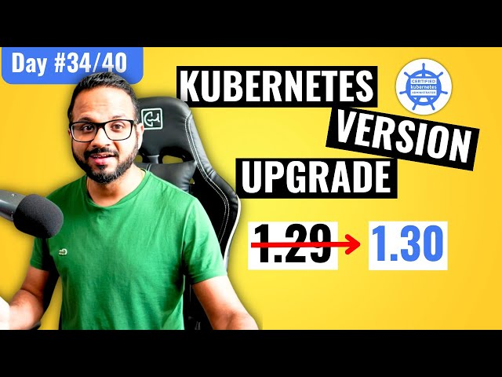

# Day 34/40 - Step-by-Step Guide to Upgrading a Multi-Node Kubernetes Cluster with Kubeadm



Upgrading a Kubernetes cluster is essential for accessing new features, bug fixes, and security patches. Today's focus is on upgrading a multi-node Kubernetes cluster using kubeadm.

## Overview of Kubernetes Release Format

1. Kubernetes Component Versions: Most components share the same version (e.g., 1.31.x), but ETCD and CoreDNS have separate versioning.
2. Upgrade Rule: Upgrade only one minor version at a time for stability.

## Cluster Upgrade Process

The upgrade involves two key steps:

1. Upgrade the Master Node
2. Upgrade the Worker Nodes

>>Note: When the master node is down during the upgrade, management operations (e.g., kubectl commands) are unavailable. However, pods continue to run without disruption.

## Detailed Upgrade Steps
### Step 1: Upgrade the Master Node

#### 1. Check Available Versions:

```
sudo apt update  
sudo apt-cache madison kubeadm  
```

Identify the latest patch for your target version (1.31.x).

#### 2. Upgrade kubeadm:

```
sudo apt-mark unhold kubeadm && \
sudo apt-get update && \
sudo apt-get install -y kubeadm=1.31.x-1 && \
sudo apt-mark hold kubeadm  
```

### 3. Plan the Upgrade:
Run:

```
sudo kubeadm upgrade plan  
```

This shows the versions available for upgrade.

#### 4. Apply the Upgrade:

```
sudo kubeadm upgrade apply v1.31.0  
```

#### 5. Drain the Node:

```
kubectl drain <master-node-name> --ignore-daemonsets  
```

#### 6. Upgrade kubelet and kubectl:

```
sudo apt-mark unhold kubelet kubectl && \
sudo apt-get update && \
sudo apt-get install -y kubelet=1.31.x-1 kubectl=1.31.x-1 && \
sudo apt-mark hold kubelet kubectl  
```

#### 7. Restart Kubelet:

```
sudo systemctl daemon-reload  
sudo systemctl restart kubelet  
```

#### 8. Uncordon the Node:

```
kubectl uncordon <master-node-name>  
```

### Step 2: Upgrade Worker Nodes

Repeat the same process as above for each worker node.

>Reference: You can also refer to the [official Kubernetes upgrade guide](https://kubernetes.io/docs/tasks/administer-cluster/kubeadm/upgrading-linux-nodes/).


## Post-Upgrade Validation

### 1. Check Cluster Health:

```
kubectl get nodes  
```

Verify that all nodes are in the Ready state and running the upgraded versions of kubelet, kubectl, and kubeadm.

### 2. Test Application Pods:
Ensure applications are running smoothly without disruptions.

## Key Takeaways

1. Sequential Process: Always upgrade the master node first, followed by the worker nodes.
2. Minimal Downtime: Applications continue to run during the master node upgrade, ensuring high availability.
3. Version Compatibility: Upgrade components like kubelet, kubectl, and kubeadm to matching versions for smooth operations.

## 📽️ Video Reference
For detailed guidance, check out the video:
[](https://youtu.be/NtX75Ze47EU)

## Insights and Reflections

Upgrading a Kubernetes cluster with kubeadm is a structured process that ensures minimal disruption while maintaining compatibility. As Kubernetes evolves, staying updated is crucial for leveraging new capabilities.

## Share Your Learnings

Sharing is learning! Here's how I upgraded my Kubernetes cluster. Have you performed a cluster upgrade recently? Let me know your tips!

Tagging [@Eric mwakazi](https://www.linkedin.com/in/eric-mwakazi), [@PiyushSachdeva](https://www.linkedin.com/in/piyush-sachdeva) and [@CloudOps Community](https://www.linkedin.com/company/thecloudopscomm) 

#40daysofkubernetes #KubernetesUpgrade #DevOps