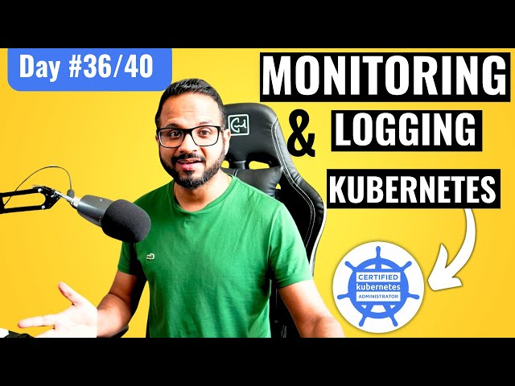

# Day 36/40 - Kubernetes Logging and Monitoring Simplified



Logging and monitoring are crucial for maintaining the health and performance of Kubernetes clusters. They provide visibility into cluster operations, enabling administrators to detect, debug, and resolve issues effectively.

## What Is Kubernetes Logging and Monitoring?

* Logging: Captures system messages, application logs, and events occurring within the cluster.
* Monitoring: Tracks cluster metrics (CPU, memory, disk usage, etc.) to analyze performance trends and detect anomalies.

## Step-by-Step Guide to Kubernetes Logging and Monitoring

#### Step 1: Install Metrics Server

The Metrics Server collects resource usage data from Kubernetes nodes and pods. Follow the official documentation to install it.

1. Clone the Metrics Server repository:
```
git clone https://github.com/kubernetes-sigs/metrics-server.git
cd metrics-server
```

2. Deploy Metrics Server:
```
kubectl apply -f deploy/kubernetes/
```

3. Verify installation:

```
kubectl get apiservices
kubectl top nodes
kubectl top pods
```

#### Step 2: Enable Logging

Logging in Kubernetes is achieved through log aggregation solutions like Fluentd, Elasticsearch, and Kibana (EFK).

1. View logs of a specific pod:
```
kubectl logs <pod-name>
```

2. Stream logs in real time:
```
kubectl logs -f <pod-name>
```

3. Check logs for multiple pods in a Deployment:

```
kubectl logs -l app=<deployment-name>
```

4. For advanced logging, integrate Fluentd and Elasticsearch for centralized log management.

#### Step 3: Explore Monitoring Tools

Kubernetes supports various monitoring tools for in-depth insights:

##### 1. Prometheus and Grafana:
* Prometheus collects metrics from cluster components and applications.
* Grafana visualizes these metrics in dashboards.

Deploy Prometheus:
```
kubectl apply -f https://raw.githubusercontent.com/prometheus-operator/prometheus-operator/main/bundle.yaml
```

##### 2. Kubernetes Dashboard:
Provides a web-based UI to monitor the cluster.

Deploy the Dashboard:

```
kubectl apply -f https://raw.githubusercontent.com/kubernetes/dashboard/v2.7.0/aio/deploy/recommended.yaml
```

## Insights from This Exercise

* Centralized Monitoring: Tools like Metrics Server and Prometheus make resource monitoring seamless.
* Proactive Maintenance: Logs provide critical insights for debugging and preventing downtime.
* Scalable Solutions: Kubernetes integrates well with external tools to handle large-scale monitoring and logging.

## 📽️ Video Reference

Check out the video below for Day35 👇

[](https://youtu.be/cNPyajLASms)

## Share Your Learnings

Logging and monitoring are essential for mastering Kubernetes operations. How do you manage logging and monitoring in your Kubernetes clusters? Share your experience in the comments!

Tagging: [@Eric mwakazi](https://www.linkedin.com/in/eric-mwakazi), [@PiyushSachdeva](https://www.linkedin.com/in/piyush-sachdeva) and [@CloudOps Community](https://www.linkedin.com/company/thecloudopscomm) 

#40daysofkubernetes #KubernetesMonitoring #DevOps
