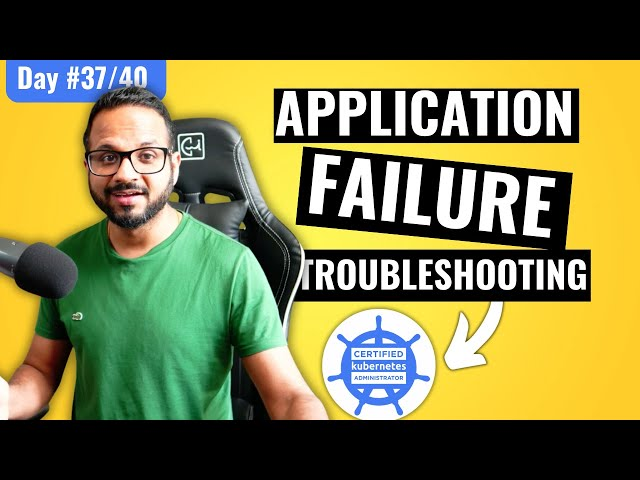

# Day 37/40 - Mastering Kubernetes Application Troubleshooting



In any Kubernetes environment, application failures are inevitable, and troubleshooting skills are essential for maintaining system health. Today, I tackled a real-world scenario by troubleshooting intentional errors in a sample Kubernetes application.

## Step 1: Preparing the Cluster

To begin, I set up the cluster and cloned the sample voting app repository:

* 1. Clone the repository:
```
git clone https://github.com/piyushsachdeva/example-voting-app
cd example-voting-app
```

* Deploy application manifests:
```
kubectl create -f k8s-specifications/
```
These manifests deployed the components of the example voting app, which were preconfigured with intentional errors for troubleshooting practice.

## Step 2: Identifying Errors

After deploying the application, I encountered issues. Using Kubernetes-native commands, I identified and isolated the errors:

* Check Pod Status:
```
kubectl get pods
```
Some pods were stuck in CrashLoopBackOff or Pending states.

* View Pod Logs:
```
kubectl logs <pod-name>
```
The logs revealed missing environment variables and incorrect image names.

* Describe Resources:
```
kubectl describe pod <pod-name>
```
This helped uncover configuration issues, such as misconfigured volume mounts and service selectors.

## Step 3: Fixing the Issues

Using insights from the diagnostics, I resolved the errors:

1. Fixing Container Images:
* Corrected image names in the deployment manifests.
* Applied updates using:
```
kubectl apply -f k8s-specifications/
```

2. Adding Missing Environment Variables:
* Updated the deployment YAML files to include required variables.
* Redeployed the pods.

3. Resolving Pending States:
* Identified insufficient resources causing pods to remain pending.
* Increased cluster resource limits to accommodate the deployment.

4. Fixing Service Selectors:
* Ensured services matched the correct pod labels.
* Applied fixes and verified service connectivity.

## Step 4: Validating Fixes

After making corrections, I validated the application state:

1. Check Pod Status:
```
kubectl get pods
```
All pods were now running as expected.

2. Test Application Functionality:
Accessed the application via the service endpoint to ensure it worked as intended.

3. Verify Logs:
```
kubectl logs <pod-name>
```
Logs confirmed that the application was running without errors.

## Key Takeaways

* Systematic Debugging: Start with basic commands like kubectl get pods and kubectl logs to identify issues.
* Common Pitfalls: Misconfigured selectors, missing environment variables, and incorrect image names are frequent culprits in application failures.
* Resource Management: Ensure the cluster has sufficient resources to avoid scheduling issues.
* Testing Fixes: Validate every change to confirm its effectiveness before proceeding further.

## 📽️ Video Reference

Check out the video below for Day35 👇

[](https://youtu.be/Mil0HUtPg6I)

## Share Your Learnings


Kubernetes troubleshooting is both challenging and rewarding. Have you faced similar issues in your cluster? Let’s discuss in the comments!

Tagging: [@Eric mwakazi](https://www.linkedin.com/in/eric-mwakazi), [@PiyushSachdeva](https://www.linkedin.com/in/piyush-sachdeva) and [@CloudOps Community](https://www.linkedin.com/company/thecloudopscomm) 

#40daysofkubernetes #KubernetesTroubleshooting #DevOps