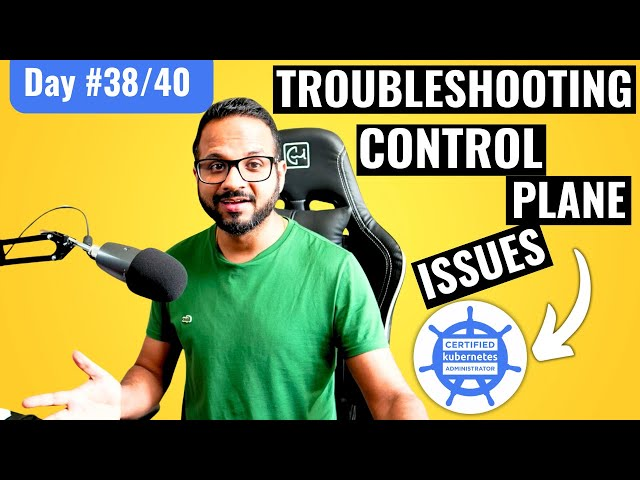

# Day 38/40 - Troubleshooting Control Plane Failures in Kubernetes



Ensuring a stable control plane is essential for Kubernetes clusters. In today’s task, I focused on diagnosing and resolving control plane issues, a critical skill for Kubernetes administrators and CKA certification preparation.

## Understanding the Control Plane

The control plane is the brain of a Kubernetes cluster, consisting of:

* API Server: Handles external and internal requests.
* Controller Manager: Manages controllers like node and replication controllers.
* Scheduler: Assigns pods to nodes.
* ETCD: Stores the cluster's state.

A failure in any component can disrupt cluster functionality, making troubleshooting a vital skill.

## Task Highlights
#### Step 1: Verifying Cluster Health

The first step was to check the cluster's overall health and identify failing components:

1. Check Node Status:
```
kubectl get nodes
```

Nodes might appear as NotReady if the control plane is malfunctioning.

2. Inspect Pods in kube-system Namespace:

```
kubectl get pods -n kube-system
```

Look for unhealthy control plane pods, such as kube-apiserver, kube-scheduler, and kube-controller-manager.

#### Step 2: Examining Logs

Logs are invaluable for identifying root causes:

1. Fetch Pod Logs:

```
kubectl logs -n kube-system <pod-name>
```

For example, checking API server logs may reveal configuration or connectivity issues.

2. Use CRICTL for Container Debugging:

```
crictl ps
crictl logs <container-id>
```

This helps debug control plane containers when kubectl is unavailable.

#### Step 3: Validating ETCD

The ETCD database is the backbone of cluster state management:

1. Check ETCD Health:

```
ETCDCTL_API=3 etcdctl --endpoints=<ETCD-endpoint> endpoint health
```

2. Inspect ETCD Logs:
```
journalctl -u etcd
```

Look for errors like disk space issues or failed connections.

## Resolving Common Control Plane Issues

### 1. Fixing API Server Failures:
* Check and correct the --etcd-servers flag in API server configurations.
* Ensure the API server can reach ETCD.

### 2. Resolving Scheduler or Controller Manager Failures:
* Verify configurations in /etc/kubernetes/manifests/.
* Restart static pods by updating the manifest files.

### 3. Addressing ETCD Problems:
* Restore ETCD from a snapshot if data corruption is detected.
* Free up disk space if storage is full.

## Validating Fixes
1. Check Control Plane Pod Status:
```
kubectl get pods -n kube-system
```
2. Verify Cluster Operations:
* Deploy a test application to ensure the cluster is functioning.

3 Monitor Logs for Stability:
* Continuous monitoring helps ensure the issues are resolved.

## Key Takeaways

1. Log Analysis: Logs are the first line of defense in troubleshooting.
2. Component Interdependencies: Understanding how control plane components interact is crucial for effective debugging.
3. Hands-On Practice: Simulating failures in a test environment builds confidence in troubleshooting.

## 📽️ Video Reference

Check out the video below for Day35 👇

[](https://youtu.be/Mil0HUtPg6I)

## Share Your Learnings

Troubleshooting control plane failures is a critical Kubernetes skill. Have you faced any control plane issues? Let’s discuss in the comments!

Tagging: [@Eric mwakazi](https://www.linkedin.com/in/eric-mwakazi), [@PiyushSachdeva](https://www.linkedin.com/in/piyush-sachdeva) and [@CloudOps Community](https://www.linkedin.com/company/thecloudopscomm) 
Hashtags: #40daysofkubernetes #KubernetesControlPlane #DevOps