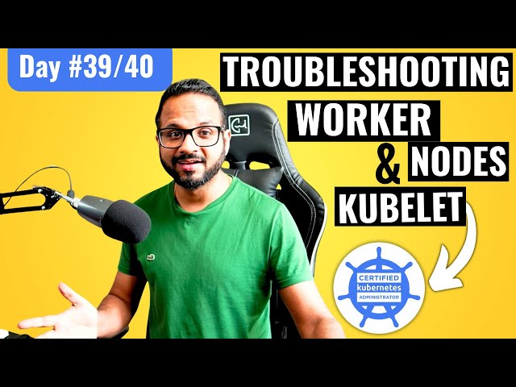

# Day 39/40 - Troubleshooting Worker Node Failures in Kubernetes



Today’s focus was on troubleshooting worker node issues in Kubernetes, a critical skill for maintaining a healthy cluster. Worker nodes are essential for running applications, so resolving their failures ensures the cluster’s reliability and availability.

## Understanding Worker Node Failures

Worker node issues can manifest as:

* Node NotReady Status: The node isn’t reporting to the control plane.
* Pod Scheduling Failures: Pods cannot be scheduled due to insufficient resources or connectivity issues.
* Kubelet Failures: Problems with the node’s agent that manages pod operations.

## Task Overview
### Step 1: Clone Repository and Simulate Issues

1. On Worker Node 1, clone the repository and navigate to the Day39 folder:

```
git clone https://github.com/piyushsachdeva/CKA-2024.git

cd CKA-2024/Resources/Day39
chmod 777 problem1.sh
./problem1.sh
```
2. Observe the introduced issues and how they impact the cluster’s health.

### Step 2: Diagnose and Resolve Issues on Worker Node 1

1. Check Node Status:
```
kubectl get nodes
```

Look for a NotReady status on the affected node.

2. Inspect Node Conditions:
```
kubectl describe node <node-name>
```

This command reveals resource pressures (e.g., disk or memory) or connectivity issues.

3. Check Kubelet Logs:
```
journalctl -u kubelet
```
Common issues include:

* Missing certificates.
* Incorrect configurations in /var/lib/kubelet/config.yaml.

4. Resolve the Problem:

* Address the root cause (e.g., clear disk space, correct configurations, or restart services).
* Restart the kubelet service:
```
systemctl restart kubelet
```
### Step 3: Repeat Steps for Worker Node 2

1. On Worker Node 2, execute the second script:

```
chmod 777 problem2.sh
./problem2.sh
```
2. Diagnose and resolve the issues as done for Worker Node 1.

### Step 4: Validate Fixes

1. Check the cluster health:
```
kubectl get nodes
```
Ensure all nodes are in the Ready state.

2. Verify pod scheduling by deploying a test application:
```
kubectl run test-pod --image=nginx --restart=Never
kubectl get pods
```

## Key Takeaways
1. Logs Are Essential: Kubelet and Docker logs provide valuable insights into node-level issues.
2. Node Conditions: Understanding conditions like DiskPressure or MemoryPressure helps resolve resource-related failures.
3. Hands-On Debugging: Running scripts to simulate real-world issues is an excellent way to prepare for CKA scenarios.

## 📽️ Video Reference

Check out the video below for Day35 👇

[](https://youtu.be/U6PRwv7dJ-U)

## Share Your Learnings

Troubleshooting worker nodes is vital for ensuring seamless Kubernetes operations. Have you faced similar challenges? Let’s discuss in the comments!

Tagging: [@Eric mwakazi](https://www.linkedin.com/in/eric-mwakazi), [@PiyushSachdeva](https://www.linkedin.com/in/piyush-sachdeva) and [@CloudOps Community](https://www.linkedin.com/company/thecloudopscomm)
Hashtags: #40daysofkubernetes #KubernetesWorkerNodes #DevOps